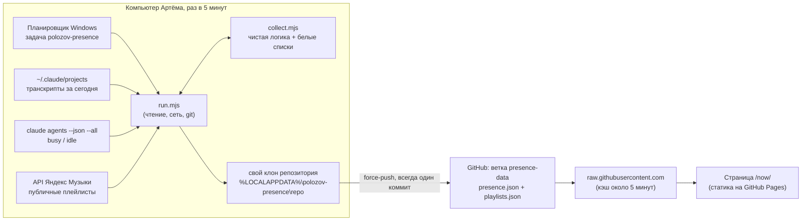

# Страница `/now/`: как она устроена

Живой документ: описывает то, что работает сейчас. Историю решений
смотрите в спеке и планах (ссылки в конце).

**Статус на 2026-09-30:** фаза 1 готова и работает. Сервера нет: сайт
остаётся статическим, данные для страницы публикует компьютер Артёма.

## Что показывает страница

| Блок | Что видно | Откуда данные |
|---|---|---|
| **Claude Code** | `working` / `waiting` / `offline`, сколько длится текущий отрезок, активное время за день, число сессий, семейство модели, «updated N min ago» | `presence.json` |
| **Music** | Публичные плейлисты Яндекс Музыки: обложка-мозаика, название, число треков, длительность. Кнопка `▸ play` открывает плеер Яндекса прямо на странице | `playlists.json` |
| **Games** | Заглушка «upcoming», данных нет | — |

Ссылки на страницу: пункт `now` в шапке (`components/SiteHeader.tsx`) и
`now →` на главной (`app/page.tsx`).

## Общая схема

Главное: **при сборке сайта ничего не скачивается.** API Яндекс Музыки
отвечает серверам GitHub `451`, а браузерам `403`. Достучаться до него
можно только с компьютера Артёма. Поэтому там раз в 5 минут запускается
маленькая программа. Она собирает данные и кладёт два JSON-файла в
отдельную ветку `presence-data`, а страница читает их прямо из браузера.

## Файлы

**Сайт** (Next.js, статический экспорт):

| Файл | Роль |
|---|---|
| `app/now/page.tsx` | Статическая оболочка страницы с тремя блоками |
| `components/ClaudePresence.tsx` | Виджет Claude Code. Читает `presence.json` при открытии, потом раз в 5 минут, пока вкладка видна. Если обновление не удалось, показывает последние удачные данные |
| `lib/claude-presence.ts` | `parsePresence`: строгая проверка файла, собирает объект только из известных ключей. `effectiveState`: данные старше 20 минут показываются как `offline`. `presenceView`: три строки виджета |
| `components/NowMusic.tsx` → `PlaylistList.tsx` → `PlaylistCard.tsx` | Блок музыки. `playlists.json` читается один раз. Плеер (iframe Яндекса) создаётся только при открытии, и открыт всегда только один |
| `lib/yandex-music.ts` | `normalizePlaylists`: только публичные плейлисты, проверка UUID (он попадает в адрес iframe), обложки только с `avatars.yandex.net`, сначала новые |
| `lib/now-config.ts` | Адреса файлов, запасная ссылка на Яндекс Музыку, пороги: устаревание 20 минут, опрос 5 минут |
| `lib/now-format.ts` | Форматы времени: `1h 20m`, `4 min ago` |
| `app/globals.css` | Стили `.now-*` |

**Компьютер Артёма** (`scripts/presence/`):

| Файл | Роль |
|---|---|
| `run.mjs` | Вся работа с внешним миром: файлы, `claude agents`, Яндекс, git. Флаг `--dry-run` только печатает результат и ничего не публикует |
| `collect.mjs` | Чистая логика без ввода-вывода: расчёт статуса, обрезка плейлистов, финальная проверка перед публикацией. Всё покрыто тестами |
| `install.ps1` | Копирует `run.mjs` и `collect.mjs` в `bin\`, запоминает путь к `node` и регистрирует задачу |
| `uninstall.ps1` | Удаляет только задачу. Клон, лог и `bin\` остаются |

Рабочие папки на компьютере, в `%LOCALAPPDATA%\polozov-presence\`:
`bin\` (закреплённая копия, которую запускает задача), `repo\` (клон,
из которого идёт публикация) и `run.log`.

## Данные

### `presence.json`: ровно 10 ключей

| Ключ | Что значит |
|---|---|
| `v` | Версия формата, всегда `1` |
| `state` | `working`, `waiting` или `offline` |
| `since` | Начало текущего отрезка активности (`null`, если `offline`) |
| `lastActive` | Последняя активность |
| `todayMinutes` | Активных минут за сегодня |
| `sessionsToday` | Сессий за сегодня |
| `model` | `opus` / `sonnet` / `haiku` / `fable` или `null` |
| `day`, `tz` | Сегодняшняя дата и часовой пояс компьютера |
| `updatedAt` | Когда собрано |

Все времена округлены до минуты.

### `playlists.json`

Та же форма, что в ответе API Яндекса (`{ "result": [...] }`), но только
публичные плейлисты и только 7 полей: `playlistUuid`, `title`,
`visibility`, `trackCount`, `durationMs`, `modified`, `cover` (`type` и
до 4 адресов обложек с `avatars.yandex.net`). Блок `owner` и всё остальное
выбрасывается.

## Как считается статус

- **working**: хотя бы одна сессия Claude Code сейчас занята
  (`claude agents` говорит `busy`).
- **waiting**: занятых нет, но активность была не больше 15 минут назад.
- **offline**: всё остальное. Сессия, открытая, но забытая на несколько
  дней, присутствием не считается.
- **Активное время за день**: все отметки времени из сегодняшних
  транскриптов склеиваются в отрезки. Если между отметками больше 15
  минут, начинается новый отрезок.
- **Модель**: семейство последнего сообщения в основной сессии.
  Субагенты считаются как активность, но их модель не берётся.
- **На странице**: если `updatedAt` старше 20 минут, виджет показывает
  `offline`, что бы ни было в файле. Строка «today …» видна, только пока
  у Артёма (в его часовом поясе) ещё тот же день.

## Один запуск `run.mjs`

1. Прочитать прошлое состояние из последнего коммита клона (`HEAD`), а
   не из рабочих файлов: запуск, упавший на полпути, мог оставить их
   неопубликованными.
2. Прочитать сегодняшние транскрипты, из каждой строки только три поля:
   `timestamp`, `sessionId`, `message.model`.
3. Спросить `claude agents --json --all` и сразу оставить только
   `busy`/`idle`.
4. Собрать `presence.json` (`buildPresence`).
5. Скачать плейлисты (таймаут 10 секунд). При ошибке на GitHub остаётся
   прошлая версия.
6. **Финальная проверка** `assertPublishable` на том самом тексте,
   который уйдёт наружу. Не прошла — ничего не публикуется.
7. **Пропуск.** Публикация пропускается, только если одновременно: было
   `offline` и сейчас `offline`, плейлисты не изменились и в клоне нет
   неотправленного коммита. То есть «офлайн» публикуется один раз, дальше
   тишина, а устаревание на странице закрывает остальное.
8. **Публикация.** Создать клон, если его нет. Удалить зависшие
   `index.lock`/`config.lock` старше 10 минут. Прописать `origin`, только
   если его нет или адрес другой. Новый клон сначала берёт уже
   опубликованный `playlists.json`. Дальше: записать файлы,
   `commit --amend` (в ветке всегда ровно один коммит), `push --force`,
   при ошибке один повтор через 5 секунд.
9. Записать строку в `run.log`.

Задача запускается раз в 5 минут и только пока Артём залогинен. Лимит на
один запуск 2 минуты, два запуска одновременно не стартуют.

## Приватность

Что уходит в открытый доступ: статус, времена, число сессий, семейство
модели, часовой пояс и публичные плейлисты. Больше ничего.

Никогда не публикуются: пути, названия проектов и веток, текст промптов,
id сессий, данные аккаунта Яндекса. Это держат три слоя:

1. `buildPresence` и `trimPlaylists` собирают файлы ключ за ключом и
   никогда не копируют входные данные целиком.
2. `assertPublishable` перед каждой публикацией (и в `--dry-run`)
   перепроверяет результат по своим, отдельным белым спискам. Сообщение
   об ошибке называет только не прошедшую проверку, без ключей и
   значений: оно пишется в лог.
3. На странице `parsePresence` и `normalizePlaylists` считают файлы
   недоверенными и пропускают только известные поля.

**Правило:** не добавлять в эти файлы ключ, который может нести путь,
название проекта, ветку, текст промпта или данные аккаунта Яндекса.

## Эксплуатация

| Что нужно | Как |
|---|---|
| Установить или обновить задачу | `powershell -NoProfile -ExecutionPolicy Bypass -File scripts\presence\install.ps1`. **Перезапускать после любой правки `scripts/presence/*.mjs`, а также после обновления или переноса Node**: задача работает с копией в `bin\`, а не с файлами репозитория |
| Удалить задачу | `scripts\presence\uninstall.ps1` |
| Проверить без публикации | `node scripts/presence/run.mjs --dry-run` |
| Посмотреть, что происходит | `%LOCALAPPDATA%\polozov-presence\run.log` (хранит последние ~500 строк) |

Строки лога:

| Строка | Значит |
|---|---|
| `published <state> … playlists=same/updated/kept` | Опубликовано. `kept`: Яндекс не ответил, осталась прошлая версия |
| `skip: offline, already published as offline …` | Нормальная тишина в офлайне |
| `yandex music failed: …` | Яндекс не ответил. Бывает несколько раз в день, проходит само |
| `push failed, retrying once: …` | Первая попытка пуша не удалась |
| `(the previous push had not landed)` | Этот запуск отправил коммит, который не ушёл в прошлый раз |
| `claude agents failed: …` | Не удалось узнать `busy`/`idle`, поэтому виджет не покажет `working` |
| `error: …` | Запуск упал. Если это сетевая ошибка пуша (`SSL_ERROR_SYSCALL`, `getaddrinfo`), следующий запуск обычно всё отправляет |

Если что-то не так на странице:

| Симптом | Где смотреть |
|---|---|
| Вместо плейлистов ссылка `yandex music ↗` | `yandex music failed` в логе. Есть ли `playlists.json` в ветке `presence-data` |
| Виджет никогда не показывает `working` | `claude agents failed` в логе |
| Виджет `offline`, хотя вы работаете | Не запускается задача (не залогинены, компьютер спал, задача удалена) или не проходит пуш (`error:` в логе). Данные старше 20 минут всегда показываются как `offline` |

Задержка от реального события до страницы: до ~15 минут (запуск раз в 5
минут, кэш GitHub около 5 минут, опрос страницы раз в 5 минут).

## Тесты

`npm test` (Vitest): `lib/claude-presence`, `lib/yandex-music`,
`lib/now-format`, `scripts/presence/collect.test.mjs` (включая тесты на
утечки и сверку списка моделей между сайтом и программой). У `run.mjs`
модульных тестов нет. Его исправления проверялись «репликой»: копией
программы, которая публикует в локальный bare-репозиторий, а не на
GitHub (сценарии описаны в плане 2026-09-29).

## Ограничения и что не сделано

Известные ограничения:

- Плеер Яндекса может не играть у посетителей не из регионов Яндекс
  Музыки.
- Данные обновляются, только пока Артём залогинен на своём компьютере.
- Видны только локальные сессии Claude Code, облачных (claude.ai/code)
  нет.
- Мелкие отложенные пункты по программе перечислены в `PROGRESS.md`,
  раздел «Now page».

Сознательно отложено на следующие фазы:

- **Игры.** У Яндекс Игр нет API активности игрока, а встроить игры на
  чужой сайт нельзя (`X-Frame-Options`).
- **Последний прослушанный трек.** Нужен Last.fm или токен Яндекса на
  сервере.
- **Облачные сессии Claude Code.**
- **Друзья, вход через Яндекс ID, «пейджер», расширение Chrome.** Для
  всего этого нужен сервер. Там открыты юридические вопросы и вопросы
  доступности из России (раздел «Фазы 2–4» в исследовании). Это отдельный
  проект, начинать с брейншторма.

## Где подробнее

- Спека фазы 1: `docs/superpowers/specs/2026-09-28-now-page-design.md`
- План фазы 1: `docs/superpowers/plans/2026-09-28-now-page.md`
- Исправления программы:
  `docs/superpowers/specs/2026-09-29-presence-runner-minors-design.md`,
  `docs/superpowers/plans/2026-09-29-presence-runner-minors.md`
- Исследование (локально, не в git): `reports/Интеграции Яндекс и Claude Code.md`
- Статус и история: `PROGRESS.md`, раздел «Now page (`/now/`)»
